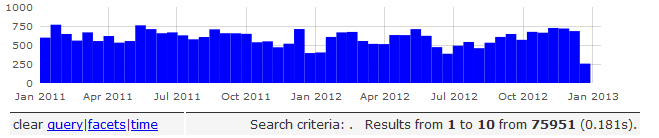
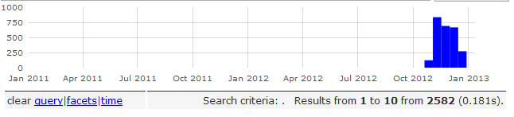
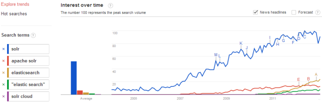
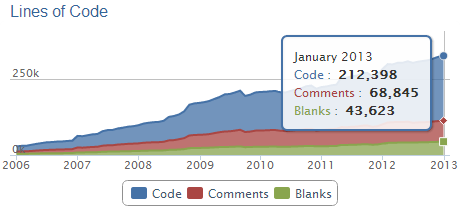
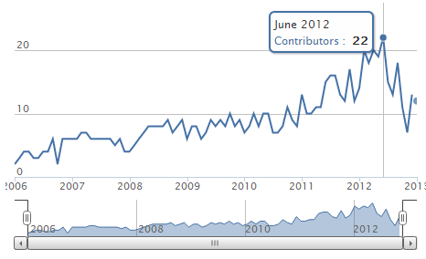
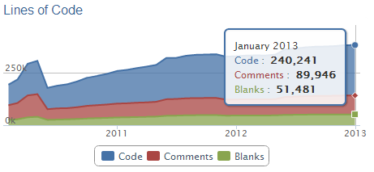
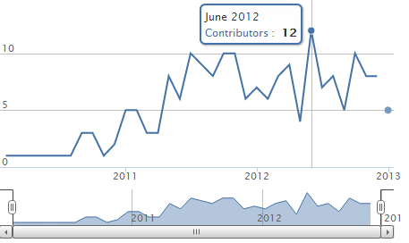

#Solr vs. ElasticSearch: Part 6 – ユーザと開発者コミュニティ

January 22, 2013 by Rafał Kuć 2 Comments

One of the questions after my talk during the recent ApacheCon EU was what I thought about the communities of the two search engines I was comparing. Not surprisingly, this is also a question we often address in our consulting engagements.  As a part of our Apache Solr vs ElasticSearch post series we decided to step away from the technical aspects of SolrCloud vs. ElasticSearch and look at the communities gathered around thesee two projects. If you haven’t read the previous posts about Apache Solr vs. ElasticSearch here are pointers to all of them:

先日のApacheCon EUの間の私の講演の後での質問の1つは私が比較した2つの検索エンジンのコミュニティについて私がどう思ったかだった。当たり前だが、これは我々がコンサルティングの契約でしばしば指摘する問題でもある。Apache Solr vs ElasticSearchシリーズの記事として我々はSolrCloud vs ElasticSearchの技術的要素から離れ、この2つのプロジェクトの周りに集ったコミュニティについて考察することを決めた。もしApache Solr vs ElasticSearchの過去の記事を読んでいない場合にはここに全てのポインタがある。

1. Solr vs. ElasticSearch: Part 1 – Overview
2. Solr vs. ElasticSearch: Part 2 – Data Handling
3. Solr vs. ElasticSearch: Part 3 – Searching
4. Solr vs. ElasticSearch: Part 4 – Faceting
5. Solr vs. ElasticSearch: Part 5 – Management API Capabilities
6. Solr vs. ElasticSearch: Part 6 – User & Dev Communities Compared

##ユーザコミュニティ

Let’s start by discussing the user activity around both ElasticSearch and Apache Solr.

ElasticSearchとApache Solrの両方のユーザの活動についての議論から始めてみよう。

###ユーザアクティビティ

We started working on this post right before the Christmas break of 2012. During that time we decided to see how active the user base was for both ElasticSearch and Apache Solr. To do that we used our handy search-lucene.com service and we compared the number of email messages sent to both user list. So let’s see how they stack up.

我々はこの記事についての活動を2012年のクリスマス休暇の前に始めた。その間我々はユーザベースがElasticSearchとApache Solrの両者についてどの程度活発であるかを調べることにした。それを行うために我々の便利なsearch-lucene.comサービスを使用し、両者のメーリングリストに送られたE-mailメッセージの数を比べてみた。まずそれらがどのように異なるか見てみよう。

####Apache Solr

As you can see, Solr user activity varies slightly from month to month which is perfectly understandable. Each bar on the chart represents two weeks. We can see the number of messages ranges from about 390 mails to about 770 per two weeks, which gives us between 800 to 1600 mails per month is we do a bit of rounding up. Quite impressive I must say!

ご覧のとおり、Solrのユーザアクティビティは月々ではっきりと異なることがとても良く理解できる。チャート上の各棒が二週間を示す。メッセージ数の範囲は二週間毎に約390通から約770通であり、月当たりでは800から1600通になることがとりあえずのまとめだ。とても印象的だと言えるだろう。

####ElasticSearch

Now let’s discuss the ElasticSearch side. First a few words of explanation. If you look at the above chart you might think that ElasticSearch mailing list was silent and then users started posting on October 2012. That’s clearly not true – it is just that we didn’t add ElasticSearch to search-lucene.com until recently.  However, you may see that the number of messages during the same period of time is quite similar – both Solr and ElasticSearch saw about 670 – 730 messages during a two weeks period. This gives us 2 emails per hour on average.

ElasticSearchの側について議論しよう。最初に少しだけ説明を行うと、上のチャートを見るとElasticSearchのMLは静かでユーザは2012年10月に投稿を開始したと思うかもしれない。それは全く正しくない。これはただ我々がElasticSearchをつい最近までsearch-lucene.comに追加しなかったためだ。しかし同じ期間のメッセージの数はとても似ていることにも気がつくだろう。SolrとElasticSearchは約670から730通を二週間の間に見ている。これは平均で1時間当たりに2通となる。

###個別のユーザ数
Email volume is one thing, but I was always curious about how many different people write emails on the mailing lists. Having such number would give us an additional understanding of the structure of the community around a particular search engine, new users, etc. However, we should not look only at this number, but also on things like most active people on the mailing lists. In both cases we’ve looked at the same period from 1 to 30 December 2012. We’ve used the data we index for search-lucene.com to calculate these numbers.

電子メールの数は1つの指標だ。しかし私は常にどれだけの異なる人がメーリングリストに書いているのかに興味があった。そのような数字を持つことにより検索エンジンや新しいユーザに関するコミュニティの構造についてより深い理解が得られる。しかしこの数字だけを見るのではなく、最もアクティブなML上の人々等も参照しよう。両方のケースについて2012年12月1日から30日という同じ期間において調べた。使用したデータは我々がsearch-lucene.comにてこれらの数字を計算するためにインデックス作成した物だ。

####Apache Solr

In case of Apache Solr there were 234 unique users sending mail to the users mailing list. Almost 8 unique users per day on average, nice :)

Apache Solrでは234人の独立したユーザがユーザメーリングリストにメールを送っていた。平均で1日に約8人の独立したユーザである。素晴しい :)

####ElasticSearch

In case of ElasticSearch there were 271 unique users sending mail to the users mailing list. This gives us about 9 unique users per day on average which is even nicer.

ElasticSearchの場合、271人の独立したユーザがユーザメーリングリストにメールを投稿していた。平均で1日当たり約9人であり、より良い。

##使用可能なリソース

As far as resources available, both ElasticSearch and Solr have great documentation. On Solr wiki site (http://wiki.apache.org/solr/) you can find information about most of the components and of course the tutorial for beginners. ElasticSearch is very similar, with tutorial and very good description of functionality available at http://www.elasticsearch.org/. In addition to that, there are three books published about Apache Solr (in English) and more (e.g. my Apache Solr 4 Cookbook) coming soon. As of now, there are no published books about ElasticSearch, but…. stay tuned :)

使用可能なリソースに関して、ElasticSearchとSolrの両方がとても良いドキュメントを持っている。Solr Wiki Site(http://wiki.apache.org/solr/)ではほとんどのコンポーネントともちろん初心者向けチュートリアルに関する情報が見つけられる。ElasticSearchも同様でチュートリアルととても良い機能説明がhttp://www.elasticsearch.org/に存在する。加えてApach Solrには（英語の）本が3冊出版されており、さらに（例えば私のApache Solr 4 Cookbook）がすぐに用意される予定だ。現在の所ElasticSearchに関する本はまだ出版されていないが、しかし、、乞うご期待。:)

##検索上のトレンド

We also decided to use uncle Google to look at trends about Apache Solr and ElasticSearch. Let’s look at the following diagram:

Googleおじさんを使用してApache SolrとElasticSearchのトレンドを調べてみよう。次の図を見て欲しい。

As you can see, until early 2010 there was no interest in ElasticSearch at all, at least looking from the point of view of users searching about it. Note that we published the interview with Shay Banon over two and a half years ago – back in May 2010 – before ElasticSearch registered on Google’s search trends radar! SolrCloud didn’t exist back then, so people slowly started looking for information on SolrCloud later in 2010.  The volume of searches mentioning SolrCloud is very small even today – perhaps because people tend to search for Solr and not SolrCloud.  And while SolrCloud is still a new kid around the block, searches for Solr dwarf searches for ElasticSearch despite the buzz surrounding ElasticSearch.

ご覧のとおり、2012年初頭まではElasticSearchに対する興味は全く無かった。少なくともそれを検索した人の数という視点においてはそうだ。注意して欲しいのは我々がShay Banonとのインタビューを公開したのは2年半前だということだ。つまり2010年5月。ElasticSearchがGoogle検索エンジンのトレードレーダーに登録される前だ! SolrCloudはその当時には存在しなかった。従って人々はゆっくりとSolrCloudに関する情報を2010年末に探し始めることになる。検索量が示すのはSolrCloudは今日でもととても小さい。恐らく皆、Solrで検索し、SolrCloudではしていないからだろう。そしてSolrCloudが今でも新人であるのに対し、Solrに対する検索はElasticSearchに対する検索を小さく見せる。ElasticSearchに対するbuzzにも拘わらずにだ。

Of course, the above doesn’t say anything about the number of users of both search engines, but it definitely shows some information about the interest in these technologies.

もちろん上記は両検索エンジンのユーザ数については何も言えない。しかし両者の技術に対する興味を示すいくらかの情報であることは決定的である。

##開発者とコード

If you are familiar with ElasticSearch and Solr you’ll probably know that ElasticSearch is much younger than Apache Solr. Apache Solr was created by Yonik Seeley in 2004 and donated to Apache Software Foundation. On the other hand, the first version of ElasticSearch was released by Shay Banon in 2010. This is quite important to say before we can talk about differences about contributors and the code itself. But getting to the point – we thought that it may be interesting to see both Apache Solr and ElasticSearch look from the Bird’s Eye perspective. To do that we’ve used the statistics and charts from ohloh.net. So, let’s see what they look like.

もしあなたがElasticSearchとSolrに親しみがあれば恐らくElasticsearchのほうがApache Solrに比べて若いことを知っているだろう。Apache SolrはYonik Seeleyにより2004年に作成されApacheソフトウェア財団に寄贈された。一方、ElasticSearchの最初のバージョンは2010年にShay Banonによりリリースされた。これは貢献者とコード自身の違いについて議論する前にとても重要なことだ。しかしその点に移る前にApache SolrとElasticSearchを俯瞰的に見ると面白いだろうと考える。そうするためにohloh.netから統計とグラフを使用した。早速、それらがどのように見えるか見てみよう。

###Apache Solr
####コード上の統計

If we look at the current statistics, at the beginning of January 2013 Solr had more than 212k lines of code, with almost 7000 commits and 38 contributors. However, keep in mind that contributors are people that committed the code, not necessarily the ones that actually implemented it and provided the patch, so the actual number of contributors is much higher. The chart looks like this: !

現在の統計を見てみると、2012年1月の初頭にてSolrは212k行以上のコードを持ち、約7000コミットと38の後継者がいる。しかし、注意して欲しいのは貢献者とはコードをコミットした人々であり、実際に実装してパッチを提供した人々では必ずしも無いということだ。そのため実際の貢献者数はより高いと言えるだろう。以下にグラフを示す。

####トップ貢献者
If we look at top contributors we see Mark Miller on top, followed by Yonik Seeley and Robert Muir in the third place :)

トップ貢献者を見ればMark Millerがトップだ。続いてYonik Seeley、そしてRobert Muirが3位につけている。:)

####活動的貢献者
One more interesting thing is the number of contributors that were actively involved during a given period of time. Looking at Apache Solr since 2006 we can see the following: active_commiters_solr I think that we can say that we had a stable growth of active contributors starting from 2006 until June 2012 with a bit of downfall shortly after that. However I don’t think that the number active contributors will be dropping, it’s more likely due to a bit of exhaustion of releasing Apache Lucene and Solr 4.0 :)

もう一つ面白いことはある期間の間に実際に関係した貢献者数だ。Apache Solrに関して2006年から見てみると次の事実がわかる：
私が思うに2006年の始めから2012年の6月まで安定したアクティブな貢献者の増加があると言えるだろう。その少し後に多少の下落があるようだ。しかし私はアクティブな貢献者の数が今後減るとは思わない。むしろApache LuceneとSolrの4.0のリリースにより疲れているだけだろう。:)

###ElasticSearch
####コード上の統計

Current code statistics for ElasticSeach shows that the code base just hit the 240k LOC  with about 4.2k commits and 87 contributors. lines_of_code_es

現在のElasticSeachのコード上の統計はコードベースが240k行で4.2kのコミットと87の貢献者である。

####トップ貢献者
As we’d expect, Shay Banon is the top contributor to ElasticSearch. In the second place on the podium we have Martijn van Groningen and Igor Motov in the third place: 

予期したとおり、Shay BanonがElasticSearchに対するトップ貢献者である。二位にはMartijn van Groningenであり、三位にIgor Motovだ。

#####Active Contributors

And finally the active contributors. We don’t have the same time frame comparing to Apache Solr, which is understandable as ElasticSearch is younger, but still we can see what is happening. active_commiters_es As you can see from the first quarter of 2011 there was a number of active contributors varying from 5 to about 10 with the top at the same time as in Solr – 12 active contributors in June 2012.

最後に活動的な貢献者だ。Apache Solrに対して同じだけのタイムフレームを比較できない。ElasticSearchのほうが若いためだ。しかしそれでも何が起こっているかは見ることができるだろう。

2011の最初の四半期から見られるとおり、アクティブな貢献者の数は5から約10にまで変化しておりSolrと同時期の7月に最大の12人を記録している。

##まとめ

As everything in this post indicates, both projects’ development and user communities are strong, active, and about equal. 2013 will be an interesting year for both projects.

この記事の全てが示すとおり、両者のプロジェクトの開発者とユーザコミュニティは強力で、活動的で、そして大体等しい。2013は両者にとり面白い年になるだろう。

We are nearing the end of our SolrCloud vs. ElasticSearch series.  What else would you like us to cover?  Please use the comments to let us know!

SolrCloud vs ElasticSearchのシリーズも終わりに近づいている。他に何が聞きたいだろうか？コメント欄を通じて教えて欲しい！

- @kucrafal, @sematext